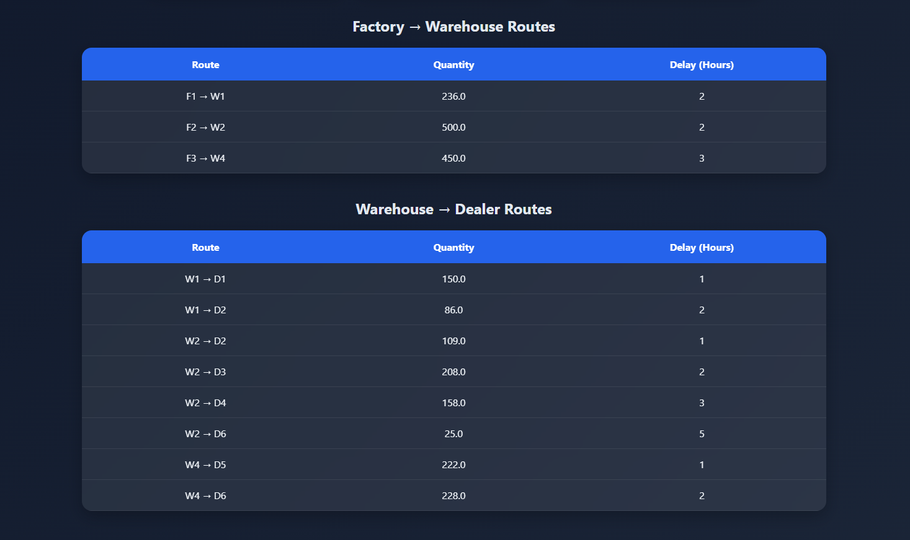

# Smart Transshipment Optimization System

The Smart Transshipment Optimization System is a Flask-based web application that optimizes the movement of goods between factories, warehouses, and dealers using Linear Programming.

The system minimizes transportation cost while considering delivery delays, warehouse capacities, and changing customer demand.

---
## Features

- Transportation Cost Optimization
- Delay-Aware Route Selection
- Warehouse Capacity Constraints
- Dynamic Demand Simulation
- Network Visualization using NetworkX
- Interactive Web Interface using Flask
- Supply Chain Route Analysis
 --- 

 ## Optimization Objectives

 - Minimize transportation cost
 - Minimize transportation delay
 - Satisfy dealer demand
 - Respect dealer demand
 - Respect warehouse capacity constraints
 - Maintain flow balance across warehouses
 ---
## Technologies Used

- Python
- Flask
- PuLP (Linear Programming)
- Pandas
- NetworkX
- Matplotlib
- HTML
- CSS
---
## Workflow
```
Dataset → Optimization Engine → Flask Backend → Visualization
```
---

# Project Structure

```text
transshipment-problem/
│
├── data/
│   ├── dealers.csv
│   ├── factories.csv
│   ├── factory_to_warehouse.csv
│   ├── warehouse_to_dealer.csv
│   └── warehouse.csv
│
├── images/
│   ├── graph.png
│   ├── home.png
│   └── result.png
│
├── solver/
│   ├── __init__.py
│   └── optimizer.py
│
├── static/
│   └── style.css
│
├── templates/
│   ├── index.html
│   └── result.html
│
├── app.py
├── requirements.txt
└── README.md
```
---

# Output
## Home Page


## Optimization Result




## Network Visualization


---

# Installation

## 1. Clone the Repository

```bash
git clone https://github.com/DhanushRam0724/smart-transshipment-system
```

## 2. Navigate to the Project Folder

```bash
cd smart-transshipment-system
```


---

# Install Dependencies

```bash
pip install -r requirements.txt
```

---

# Run the Application

```bash
python app.py
```

---

# Open in Browser

```text
http://127.0.0.1:5000
```

---

# Sample Datasets

The system uses CSV files for:

- Factory supply data
- Warehouse capacity data
- Dealer demand data
- Transportation costs

This makes the project flexible and scalable for different logistics scenarios.

---

# Applications

- Supply Chain Management
- Logistics Optimization
- Distribution Planning
- Transportation Analytics
- Warehouse Network Design

---

# Future Scope

- AI-based demand forecasting
- Google Maps API integration
- Real-time traffic integration
- Vehicle routing system
- Warehouse inventory prediction
- Dynamic transportation pricing
- Interactive dashboards
- Cloud deployment

---

# Learning Outcomes

This project demonstrates:

- Operations Research concepts
- Linear Programming implementation
- Optimization modeling with PuLP
- Flask backend development
- Data handling using Pandas
- Graph visualization using NetworkX
- Real-world logistics problem-solving

---

# Author

## Dhanush Ram S

Engineering Student  | Optimization & Data Enthusiast

---
