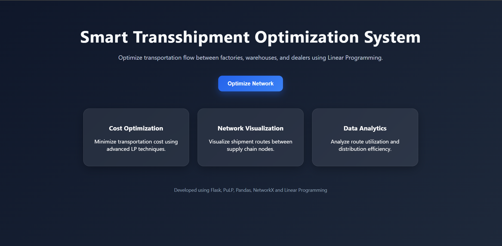
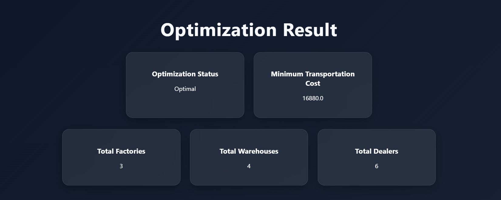
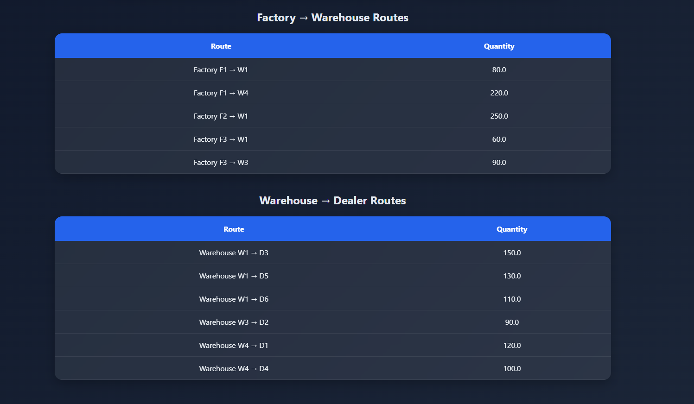
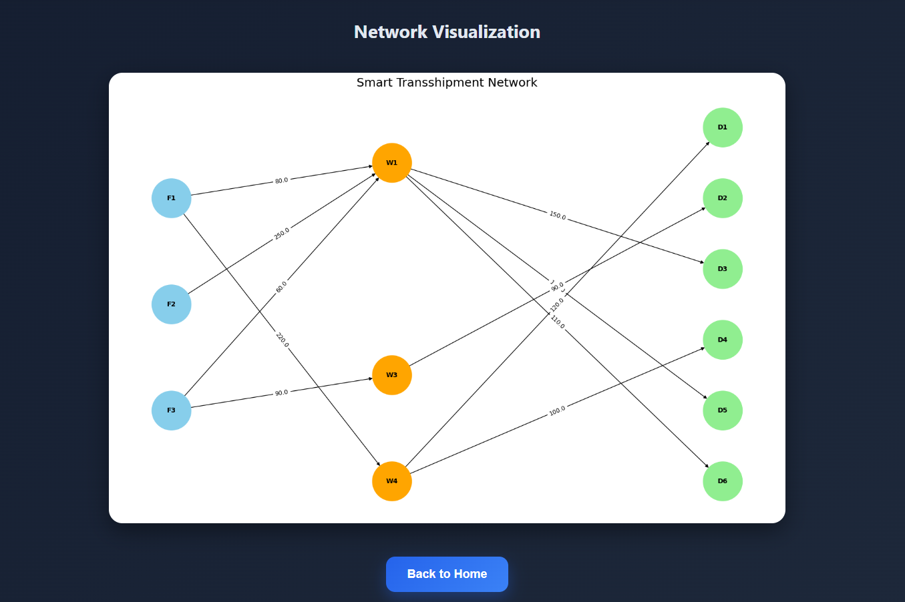

# Smart Transshipment Optimization System

A Flask-based logistics optimization platform using Linear Programming and PuLP to minimize transportation cost between factories, warehouses, and dealers.

The system models a real-world supply chain network and finds the optimal shipment routes while satisfying supply and demand constraints.

---
## Features

- Multi-stage transshipment optimization
- Transportation cost minimization
- Supply-demand balancing
- Dataset-driven logistics network
- Route optimization using Linear Programming
- Interactive Flask web interface
- Network graph visualization
- Real-time optimization result display
 --- 
## Technologies Used

- Python
- Flask
- PuLP
- Pandas
- NetworkX
- Matplotlib
---
## Workflow
```
Dataset → Optimization Engine → Flask Backend → Visualization
```
---

# Project Structure

```text
transshipment-problem/
│
├── data/
│   ├── dealers.csv
│   ├── factories.csv
│   ├── factory_to_warehouse.csv
│   ├── warehouse_to_dealer.csv
│   └── warehouses.csv
│
├── images/
│   ├── graph.png
│   ├── home.png
│   └── result.png
│
├── solver/
│   ├── __init__.py
│   └── optimizer.py
│
├── static/
│   └── style.css
│
├── templates/
│   ├── index.html
│   └── result.html
│
├── app.py
├── requirements.txt
└── README.md
```
---

# Output
## Home Page




## Optimization Result




## Network Visualization




---

# Installation

## 1. Clone the Repository

```bash
git clone https://github.com/DhanushRam0724/smart-transshipment-system
```

## 2. Navigate to the Project Folder

```bash
cd smart-transshipment-system
```


---

# Install Dependencies

```bash
pip install -r requirements.txt
```

---

# Run the Application

```bash
python app.py
```

---

# Open in Browser

```text
http://127.0.0.1:5000
```

---

# Sample Datasets

The system uses CSV files for:

- Factory supply data
- Warehouse capacity data
- Dealer demand data
- Transportation costs

This makes the project flexible and scalable for different logistics scenarios.

---

# Applications

- Supply Chain Management
- Logistics Optimization
- Distribution Planning
- Transportation Analytics
- Warehouse Network Design

---

# Future Scope

- AI-based demand forecasting
- Google Maps API integration
- Real-time traffic optimization
- Vehicle routing system
- Warehouse inventory prediction
- Dynamic transportation pricing
- Interactive dashboards
- Cloud deployment

---

# Learning Outcomes

This project demonstrates:

- Operations Research concepts
- Linear Programming implementation
- Optimization modeling with PuLP
- Flask backend development
- Data handling using Pandas
- Graph visualization using NetworkX
- Real-world logistics problem-solving

---

# Author

## Dhanush Ram S

Engineering Student  | Optimization & Data Enthusiast

---
